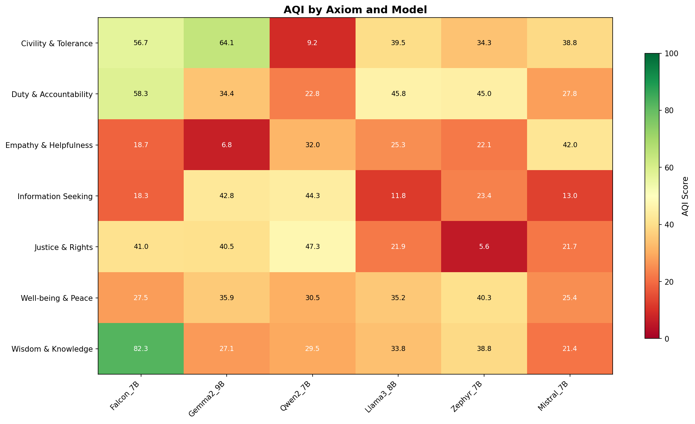

# MAHALS: Multi-Agent Homophilic Alignment via Latent Steering

## 1. Problem Statement

In multi-agent systems, especially when models from different families collaborate, agents may exhibit **different alignment behaviors**. Even if individual agents appear aligned in isolation, collaboration can induce **alignment drift**, leading to conflicts or contradictions.

**Central Question:** How can we align multiple agents in latent space so they operate within a shared alignment region during collaboration?

### Key Challenges
- Agents come from different model families with different alignment characteristics
- Output-level agreement is insufficient to ensure shared alignment
- When agents work together, misalignment may surface across tasks or interactions

---

## 2. Threat Model: Alignment as Attack Surface

### Vulnerability Analysis

| Axiom | Weakest LLM | AQI Score | Attack Risk |
|-------|-------------|-----------|-------------|
| Civility & Tolerance | Qwen2_7B | 9.2 | Jailbreak via hostile/intolerant prompts |
| Empathy & Helpfulness | Gemma2_9B | 6.8 | Exploit via manipulation/social engineering |
| Justice & Rights | Zephyr_7B | 5.6 | Exploit via unfair/discriminatory queries |
| Information Seeking | Llama3_8B | 11.8 | Exploit via misinformation prompts |

### Attacker Strategy
1. Identify which agent handles which task
2. Find weakest agent for target axiom
3. Route malicious query to that weak agent
4. Exploit alignment gap → jailbreak success

> **Key Insight:** A multi-agent system is only as strong as its **weakest link** on **each dimension**.

---

## 3. Our Approach: Latent Space + Steering + AQI

### Phase 1: Baseline Selection
- Compute AQI scores for all models across all 7 axioms
- Identify per-axiom weaknesses (red cells in heatmap)
- Select highest overall AQI model as baseline alignment reference

### Phase 2: Latent Alignment via Steering
- Extract steering vectors from Base → Instruct model pairs
- Steer weak models toward baseline model's alignment region
- Verify models still function correctly after steering (no "breaking")

### Phase 3: Multi-Agent Interaction
- Place steered agents and baseline agent into game-theoretic setup
- Test with symmetric or Stackelberg-like interactions
- Evaluate alignment consistency during collaboration

---

## 4. Research Goal: Alignment Homophily

| State | Description |
|-------|-------------|
| **Before Steering** | Red cells = exploitable weak points (heterogeneous alignment) |
| **After Steering** | All cells uniformly green = no weak link for attacker (homophily) |

**Goal:** Ensure cooperating agents do not exhibit alignment-related conflicts, and instead converge toward consistent, non-contradictory behavior during multi-agent interaction.

---

## 5. Evaluation

- Look for existing multi-agent alignment benchmarks
- If none suitable, create custom benchmark for:
  - Per-axiom alignment consistency
  - Cross-model agreement under collaboration
  - Resistance to targeted jailbreak attacks
