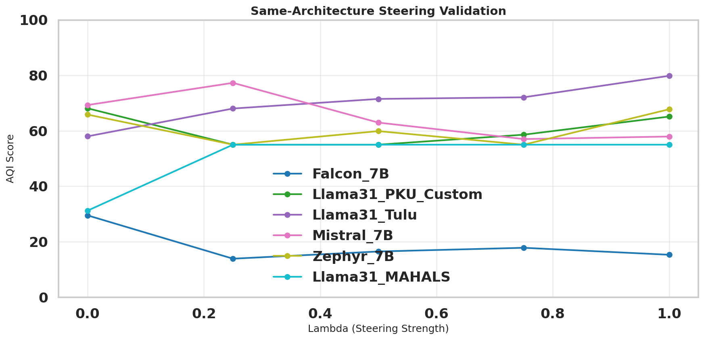

# Phase 3: Same-Architecture Steering Validation - Observations

> **Date**: Jan 24, 2026
> **Script**: `src/m04_same_arch_validation.py`
> **Mode**: sanity (100 samples/category)

---

## Results Summary

### AQI vs Lambda (Steering Strength)

| Model | λ=0.0 (Base) | λ=0.25 | λ=0.5 | λ=0.75 | λ=1.0 | Trend |
|-------|:------------:|:------:|:-----:|:------:|:-----:|-------|
| **Zephyr_7B** | 66 | 55 | 60 | 55 | **68** | Non-monotonic, slight improvement |
| **Falcon_7B** | 29 | 14 | 17 | 18 | **16** | Degraded |
| **Mistral_7B** | 70 | 77 | 63 | 58 | **58** | Degraded |

### Comparison: Phase 1 (Instruct) vs Phase 3 (Steered Base)

| Model | Phase 1 AQI (Instruct) | Phase 3 λ=0 (Base) | Phase 3 λ=1 (Steered) | Expected |
|-------|:----------------------:|:------------------:|:---------------------:|----------|
| Zephyr_7B | 55.0 | 66 | 68 | λ=1 should match Instruct |
| Falcon_7B | 5.0 | 29 | 16 | λ=1 should match Instruct |
| Mistral_7B | 55.0 | 70 | 58 | λ=1 should match Instruct |

---

## Verdict: Steering Did NOT Work As Expected

### Key Findings

1. **Not monotonic** - All models show erratic AQI vs λ curves
2. **Falcon/Mistral degraded** - Steering made alignment WORSE (AQI dropped)
3. **Unexpected baseline** - Base models (λ=0) have HIGHER AQI than Instruct models from Phase 1

### Critical Anomaly

> **Why does BASE model AQI (66-70) exceed INSTRUCT model AQI (55)?**

Possible explanations:
- Data/evaluation inconsistency between Phase 1 and Phase 3
- Instruction-tuning doesn't improve alignment on LITMUS dataset
- Different random seeds or sample selection between phases

---

## Root Cause Analysis

From `plan.md` Phase 2 POC Note:

> **Current implementation uses Base→Instruct pairs** (general alignment direction).
> For pure D-STEER replication, future work should use **SFT→DPO** pairs.

**D-STEER paper used SFT→DPO pairs, not Base→Instruct.**

The steering vector `v = h_instruct - h_base` may not represent the "alignment direction" when using Base→Instruct pairs.

---

## Recommended Next Steps

| Priority | Action | Rationale |
|:--------:|--------|-----------|
| **1** | Try SVD steering vectors | Use `steering_vector_svd3.pth` - SVD may filter noise from raw delta |
| **2** | Vary steering layers | Try all layers vs last-5; norm plots showed spikes at specific layers |
| **3** | Reverse steering direction | Try negative λ or `h_base - v` instead of `h_base + v` |
| **4** | Debug Phase 1 vs Phase 3 gap | Investigate why Base AQI > Instruct AQI (unexpected) |
| **5** | Find SFT→DPO model pairs | This is the correct steering direction per D-STEER paper |

---

## Technical Notes

- **Steering formula**: `h_steered[l] = h_base[l] + λ * v[l]`
- **Preserve norm**: Enabled (steered norm matches original)
- **Steering layers**: Last 5 layers `[27, 28, 29, 30, 31]`
- **Dataset**: LITMUS (hasnat79/litmus) - 1,400 samples (sanity mode)
